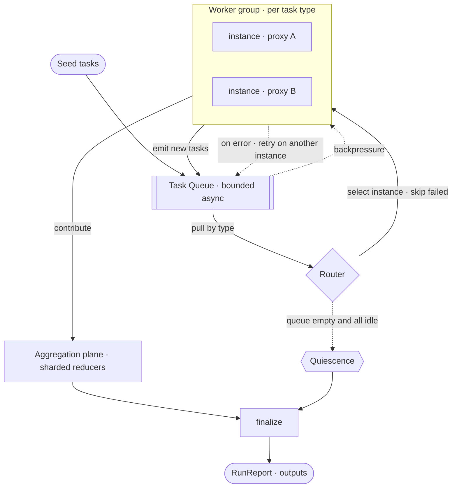

# Bask

> **B**uild T**ask**s



## Python

```python
from bask import Engine


class Document:
    def __init__(self, text):
        self.text = text


class Word:
    def __init__(self, value):
        self.value = value


engine = Engine()


@engine.worker(Document)
def split(doc, ctx):
    for word in doc.text.split():
        ctx.emit(Word(word.lower()))


@engine.worker(Word)
def count(word, ctx):
    ctx.aggregate(WordCount, word.value)


@engine.aggregator
class WordCount:
    def __init__(self):
        self.counts = {}

    def fold(self, word):
        self.counts[word] = self.counts.get(word, 0) + 1

    def finalize(self):
        return self.counts


engine.seed(Document("the quick brown fox the fox"))
report = engine.run()
print(report.output(WordCount))
```

## Rust

```rust
use std::collections::HashMap;
use bask::prelude::*;

struct Document { text: String }
struct Word(String);

struct Split;
#[async_trait]
impl Worker for Split {
    type Task = Document;
    async fn process(&self, doc: &Document, ctx: &Context) -> anyhow::Result<()> {
        for word in doc.text.split_whitespace() {
            ctx.emit(Word(word.to_lowercase())).await?;
        }
        Ok(())
    }
}

struct Count;
#[async_trait]
impl Worker for Count {
    type Task = Word;
    async fn process(&self, word: &Word, ctx: &Context) -> anyhow::Result<()> {
        ctx.aggregate::<WordCount>(word.0.clone());
        Ok(())
    }
}

struct WordCount;
impl Aggregator for WordCount {
    type Input = String;
    type State = HashMap<String, u64>;
    type Output = HashMap<String, u64>;
    fn fold(state: &mut Self::State, word: String) { *state.entry(word).or_default() += 1; }
    fn merge(left: &mut Self::State, right: Self::State) {
        for (word, n) in right { *left.entry(word).or_default() += n; }
    }
    fn finalize(state: Self::State) -> Self::Output { state }
}

#[tokio::main]
async fn main() -> anyhow::Result<()> {
    let report = Engine::builder()
        .worker(Split)
        .worker(Count)
        .aggregator::<WordCount>()
        .seed(Document { text: "the quick brown fox the fox".into() })
        .run()
        .await?;
    println!("{:?}", report.output::<WordCount>().unwrap());
    Ok(())
}
```

## Acknowledgements

Developed by Wavelens GmbH. Support us by contributing.
