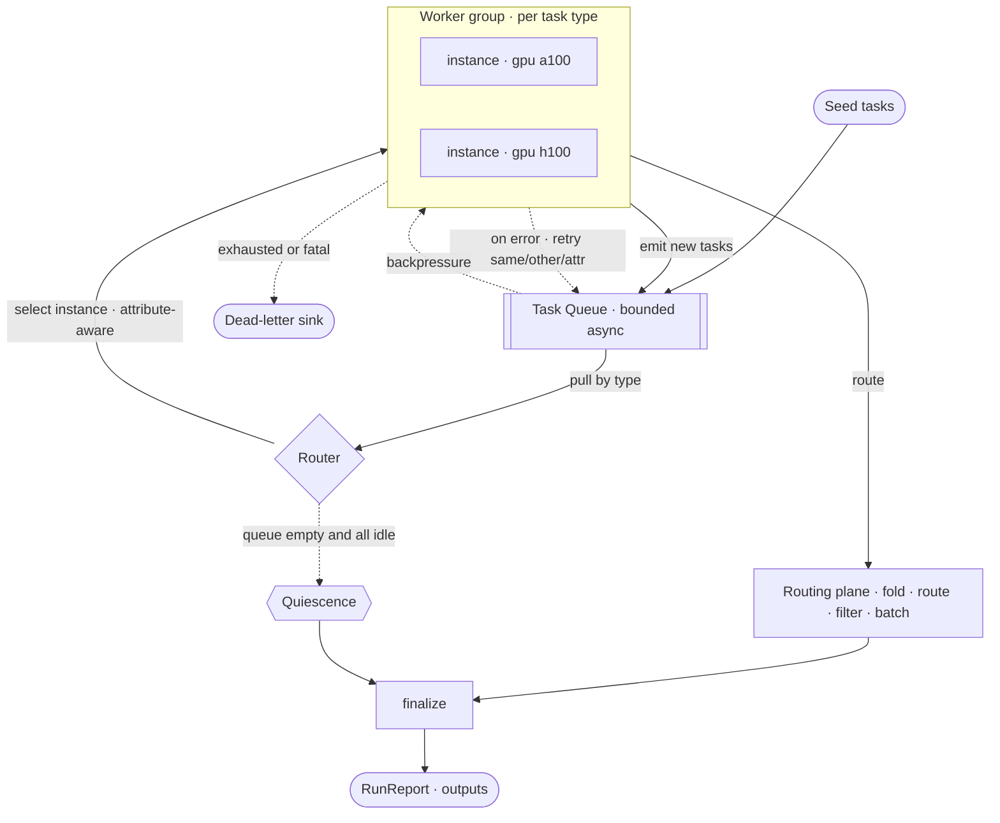

# Bask

> **B**uild T**ask**s



## Python

```python
from bask import Engine, Worker


class Document:
    def __init__(self, text):
        self.text = text


class Word:
    def __init__(self, value):
        self.value = value


engine = Engine()


@engine.worker(Document)
class Split(Worker):
    def process(self, doc, ctx):
        for word in doc.text.split():
            ctx.emit(Word(word.lower()))


@engine.worker(Word)
class Count(Worker):
    def process(self, word, ctx):
        ctx.route(WordCount, word.value)


# A router folds a value into state and may out.emit(task) to route, filter, or batch.
@engine.router
class WordCount:
    def __init__(self):
        self.counts = {}

    def route(self, word, out):
        self.counts[word] = self.counts.get(word, 0) + 1

    def finalize(self):
        return self.counts


engine.seed(Document("the quick brown fox the fox"))
report = engine.run()
print(report.output(WordCount))
```

## Rust

```rust
use std::collections::HashMap;
use bask::prelude::*;

struct Document { text: String }
struct Word(String);

struct Split;
#[async_trait]
impl Worker for Split {
    type Task = Document;
    async fn process(&self, doc: &Document, ctx: &Context) -> anyhow::Result<()> {
        for word in doc.text.split_whitespace() {
            ctx.emit(Word(word.to_lowercase())).await?;
        }
        Ok(())
    }
}

struct Count;
#[async_trait]
impl Worker for Count {
    type Task = Word;
    async fn process(&self, word: &Word, ctx: &Context) -> anyhow::Result<()> {
        ctx.route::<WordCount>(word.0.clone()).await?;
        Ok(())
    }
}

// A Router folds a task stream into state and may emit, route, filter, or batch
// derived tasks. Emit nothing (as here) and it is a pure reducer.
struct WordCount;
impl Router for WordCount {
    type Input = String;
    type State = HashMap<String, u64>;
    type Output = HashMap<String, u64>;
    fn route(state: &mut Self::State, word: String, _out: &mut Emit) {
        *state.entry(word).or_default() += 1;
    }
    fn merge(left: &mut Self::State, right: Self::State) {
        for (word, n) in right { *left.entry(word).or_default() += n; }
    }
    fn finalize(state: Self::State) -> Self::Output { state }
}

#[tokio::main]
async fn main() -> anyhow::Result<()> {
    let report = Engine::builder()
        .worker(Split)
        .worker(Count)
        .router::<WordCount>()
        .seed(Document { text: "the quick brown fox the fox".into() })
        .run()
        .await?;
    println!("{:?}", report.output::<WordCount>().unwrap());
    Ok(())
}
```
## Acknowledgements

Developed by Wavelens GmbH. Support us by contributing.
